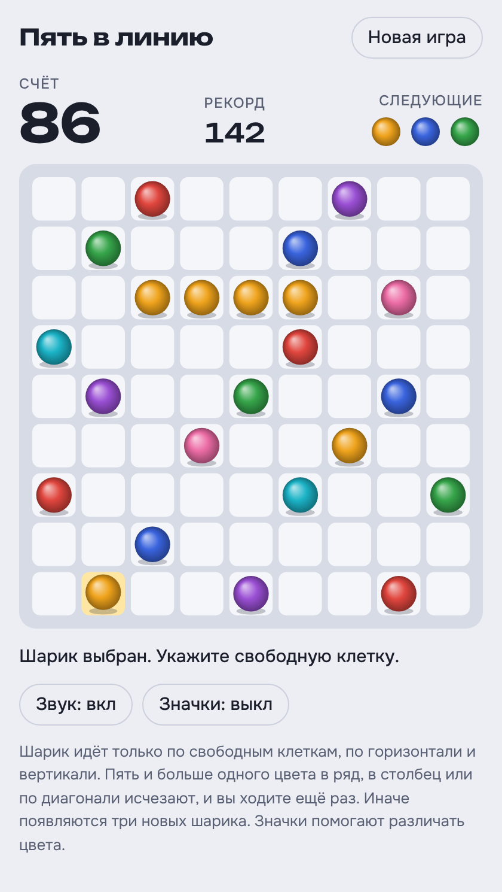
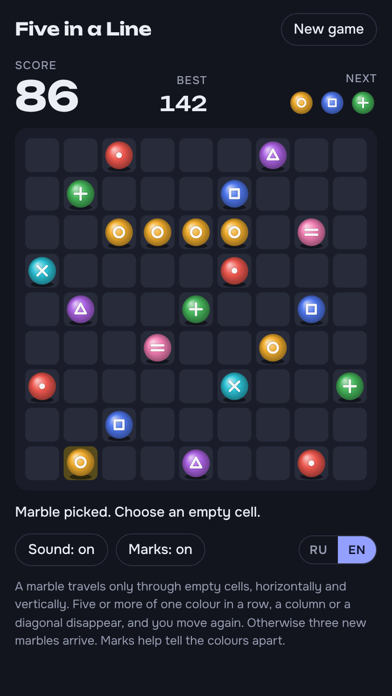

# Five in a Line

[Русская версия](README.ru.md)

A browser puzzle that follows the rules of Color Lines (1992). Move marbles on a 9 × 9 board and line up five of one colour before the board fills.

**[Play in the browser](https://posoxai.github.io/FiveInLineGame/)**

  
  

Left: the light theme with the Russian interface. Right: the dark theme with the English one and marks switched on.

## Rules

- The board is 9 × 9 and there are seven colours. A game starts with five marbles.
- Pick a marble, then an empty cell. The marble gets there only if a path of empty cells leads to it, moving horizontally and vertically.
- Five or more marbles of one colour in a row, a column or a diagonal disappear, and you move again.
- If no line is made, three new marbles arrive. Their colours are shown in advance under Next.
- New marbles can complete a line too. It disappears and scores as usual.
- The game ends when the board is full.

## Scoring

| Marbles in the line | Points |
| --- | --- |
| 5 | 10 |
| 6 | 12 |
| 7 | 18 |
| 8 | 28 |
| 9 | 42 |

Each marble beyond nine adds 16 more points. That can happen when one move completes two crossing lines.

The scoring table is this version's own. Descriptions of the original say only that longer lines score considerably more.

## Controls

- Mouse or touch: tap a marble, then an empty cell.
- Keyboard: arrow keys move the cursor, Enter or Space picks a marble and a cell.
- Marks draws a shape on every marble, so colours can be told apart by more than hue.
- New game asks for confirmation when the current game already has points.

An unfinished game, the best score and the settings are kept in the player's browser.

## Language

The interface is in English and Russian. It opens in Russian when Russian is among the browser's languages and in English otherwise. The RU/EN switch remembers your choice.

## How to run

The whole game is one file, `index.html`. There is no build step and there are no dependencies.

- Locally: open `index.html` in a browser.
- Online: the game is published with GitHub Pages at https://posoxai.github.io/FiveInLineGame/. Every commit to `main` updates it automatically.

Fonts load from Google Fonts. Without a network the game falls back to system fonts.

## Visit counter

The published page counts visits with [GoatCounter](https://www.goatcounter.com/). According to the service, it sets no cookies and stores no personal data. The counter does not run when `index.html` is opened from disk.

## Credits

The game was written by Claude, the AI assistant made by Anthropic: the logic, the canvas graphics, the sound and the page design.

The rules belong to Color Lines, made in 1992 by Oleg Demin, Gennady Denisov and Igor Ivkin and published by Gamos. The graphics, the name and the design of this version are its own; only the rules come from the original.

The idea of making a browser version came from posoxAI.

## License

MIT. The full text is in [LICENSE](LICENSE).
